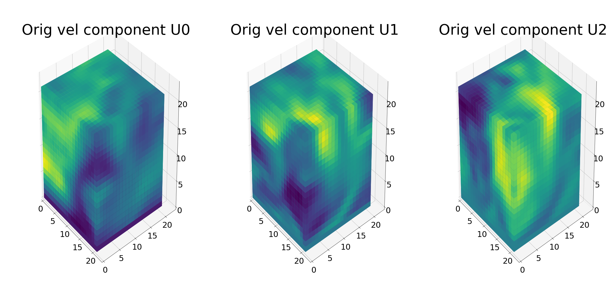
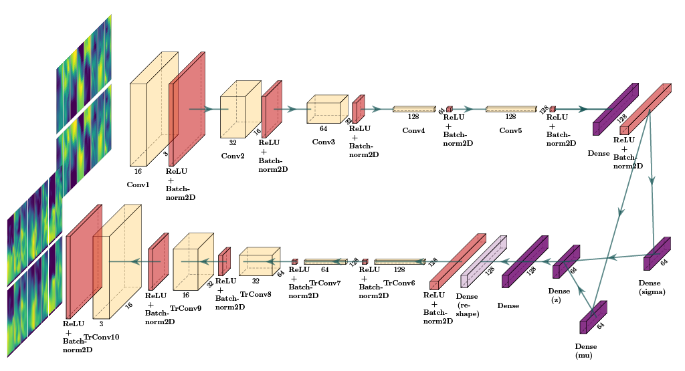

# 3D-CFD-Processing-CVAE

A Convolutional Variational Autoencoder (CVAE) for 3D CFD data reconstruction and generation.

## Project Summary

In this project we implement a Convolutional Variational Autoencoder (CVAE) [1] to process and reconstruct 3D turbulence data. 

We have generated 3D turbulence cubes using Computational Fluid Dynamics (CFD) methods, each 3D cube carries physical information along three velocity components (threated as separate channels in analogy to image data). 

As part of 3D CFD data pre-processing, we have written a **custom pytorch dataloader** that performs normalization and batching operations on the dataset. 

The CVAE implements 3D Convolutions (3DConvs) on the pre-processed data to perform 3D reconstruction and generation.

We have obtained substantial improvement on 3D reconstruction by fine-tunning hyperparameters and manipulating our model architecture. 

## Data Description

This dataset was generated with CFD simulation methods, it contains extracted cubes from a Heating-Ventilation-and-Air-Conditioning (HVAC) duct. 

Each cube represents a three dimensional temporal snapshot of the turbulent flow carrying physical information at a particular time. The information extracted from the simulation is based on two flow components: a velocity field *U* and static pressure *p*. The *U* field (*x*, *y*, *z*), and the scalar *p* are based on the the orientation of the flow (normal direction to the cube).

We use voxels to represent the 3D cubes as arrays of dimensions `21 × 21 × 21 x 100 (x_coord, y_coord, z_coord, timestep)`. The plot below shows one cube data sample, we visualize each velocity component using heatmaps.

<!--We feed the information of two velocity components *U_x*, *U_y* and *p* as channels into a 3D Convolution using Pyotch.-->

In total, the dataset consists of 96 simulations each with 100 time steps, this totals 9600 cubes (for each velocity component).



## Data Pre-processing

The script below shows the custom pytorch dataloader written to preprocess 3D data. Here are some highlights:

<ol>
  <li>loading and concatenation of cube velocity channels</li>
  <li>data standarization</li>
  <li>data scaling</li>
</ol> 

See ```dataloader.py``` for the full implementation.

```python
class CFD3DDataset(Dataset):
    def __init__(self, data_directory, no_simulations, simulation_timesteps, transforms=None):
        """
        data_directory: path to directory that contains subfolders with the npy files
        Subfolders are folders containing each component of velocity: extract_cubes_U0_reduced
        """

        print()
        print("[INFO] started instantiating 3D CFD pytorch dataset")

        self.data_directory = data_directory
        self.no_simulations = no_simulations # 96
        self.simulation_timesteps = simulation_timesteps # 100
        self.transforms = transforms

        # data_dir = "../cfd_data/HVAC_DUCT/cubes/coords_3d/"
        data_directory_U0 = self.data_directory + "extract_cubes_U0_reduced/"
        data_directory_U1 = self.data_directory + "extract_cubes_U1_reduced/"
        data_directory_U2 = self.data_directory + "extract_cubes_U2_reduced/"

        # read cubes data from directories
        cubes_U0_dict = self._load_3D_cubes(data_directory_U0)
        cubes_U1_dict = self._load_3D_cubes(data_directory_U1)
        cubes_U2_dict = self._load_3D_cubes(data_directory_U2)

        # compare all folders have same simulation parameters
        if self._compare_U_sim_keys(cubes_U0_dict, cubes_U1_dict) and \
           self._compare_U_sim_keys(cubes_U0_dict, cubes_U2_dict) and \
           self._compare_U_sim_keys(cubes_U1_dict, cubes_U2_dict):
            print("[INFO] all folders have same keys (simulations)")
        else:
            print("[INFO] the folders don't have the same keys (simulations)")
            quit()

        # concatenate all velocity components into one dictionary data structure
        cubes_U_all_dict = self._merge_velocity_components_into_dict(cubes_U0_dict, cubes_U1_dict, cubes_U2_dict)

        # creates a list of length timesteps x simulations, each element is a numpy array with cubes size (21,21,21,3)
        # cubes_U_all_channels: 9600 with shape (21,21,21,3)
        self.cubes_U_all_channels = self._concatenate_3_velocity_components(cubes_U_all_dict)
        print("[INFO] cubes dataset length:", len(self.cubes_U_all_channels))
        print("[INFO] single cube shape:", self.cubes_U_all_channels[0].shape)
        self.data_len = len(self.cubes_U_all_channels)

        # stack all cubes in a final numpy array numpy (9600, 21, 21, 21, 3)
        self.stacked_cubes = np.stack(self.cubes_U_all_channels, 0)

        # standardize data from here
        print()
        print("[INFO] standardize data to mean 0 and std 1")
        self.standardized_cubes = self._standardize_cubes(self.stacked_cubes)
        print("mean after standardization:", self.standardized_cubes.mean(axis=(0,1,2,3)))
        print("std after standardization:", self.standardized_cubes.std(axis=(0,1,2,3)))

        print()
        print("[INFO] finished instantiating 3D CFD pytorch dataset")
        .
        .
        .
    def __getitem__(self, index):
        """
        Returns a tensor cube of shape (3,21,21,21) normalized by
        substracting mean and dividing std of dataset computed beforehand.
        """

        single_cube_numpy = self.standardized_cubes[index] # (21, 21, 21, 3)

        # min-max normalization, clipping and resizing
        single_cube_minmax = self._minmax_normalization(single_cube_numpy) # (custom function)
        single_cube_transformed = np.clip(self._scale_by(np.clip(single_cube_minmax-0.1, 0, 1)**0.4, 2)-0.1, 0, 1) # (from tutorial)
        single_cube_resized = resize(single_cube_transformed, (21, 21, 21), mode='constant') # (21,21,21)

        # swap axes from numpy shape (21, 21, 21, 3) to torch shape (3, 21, 21, 21) this is for input to Conv3D
        single_cube_reshaped = np.transpose(single_cube_resized, (3, 1, 2, 0))

        # convert cube to torch tensor
        single_cube_tensor = torch.from_numpy(single_cube_reshaped)

        return single_cube_tensor
```

## Model Architecture

The diagram below shows a Convolutional Variational Architecture. In this case, 2DConvs are displayed for clarity, but the same architecture holds for 3DConvs. The CVAE is composed by an **encoder network** (upper part) followed by a **variational layer** (*mu* and *sigma*) and a **decoder network** (bottom part). The encoder performs downsampling operations on input cubes and the decoder upsamples them in order to regain the original shape. The variational layer attempts to learn the distribution of the dataset, this one can later be used for generation. 



We have taken as a baseline architecture the one proposed in [2] and the hyper-parameters from [3]. The encoder and decoder of the CVAE have 4 symmetrical convolutional hidden layers. Each layer of the encoder has twice the number of convolutional filters as its predecesor, this is in order to learn more complex flow features. Encoder/decoder are composed of 32, 64, 128 and 256 convolutional filters. The dense layer at the end of the encoder is used commonly to combine all the feature maps from the last hidden layer. After that, there is a variational layer that similar to VRAEs, computes the parameters of the posterior distribution and from here we compute latent vectors
using the re-parametrization trick, in this case it is `8 × 8 x 8` latent cubes. The decoder takes the latent vectors and performs the same number of operations using transposed convolutions in an upsampling
manner in order to recover (reconstruct) into the original dimensions. The CVAE is trained with two loss functions: **Mean Squared Error (MSE)** for reconstructions and **Kullback-Leibler Divergence (KLB)** for regularization of the latent space (which is modeled by the variational layer).

The script below shows an example in pytorch where an encoder and a decoder are defined using 3D convolutional layers.


```python
self.encoder = nn.Sequential(
            nn.Conv3d(in_channels=image_channels, out_channels=16, kernel_size=4, stride=1, padding=0),
            nn.BatchNorm3d(num_features=16),
            nn.ReLU(),
            nn.Conv3d(in_channels=16, out_channels=32, kernel_size=4, stride=1, padding=0),
            nn.BatchNorm3d(num_features=32),
            nn.ReLU(),
            nn.Conv3d(in_channels=32, out_channels=64, kernel_size=4, stride=1, padding=0),
            nn.BatchNorm3d(num_features=64),
            nn.ReLU(),
            nn.Conv3d(in_channels=64, out_channels=128, kernel_size=4, stride=1, padding=0),
            nn.BatchNorm3d(num_features=128),
            nn.ReLU(),
            nn.Conv3d(in_channels=128, out_channels=128, kernel_size=4, stride=1, padding=0),
            nn.BatchNorm3d(num_features=128),
            nn.ReLU(),
            Flatten()
        )

self.decoder = nn.Sequential(
            UnFlatten(),
            nn.BatchNorm3d(num_features=128),
            nn.ReLU(),
            nn.ConvTranspose3d(in_channels=128, out_channels=128, kernel_size=4, stride=1, padding=0),
            nn.BatchNorm3d(num_features=128),
            nn.ReLU(),
            nn.ConvTranspose3d(in_channels=128, out_channels=64, kernel_size=4, stride=1, padding=0),
            nn.BatchNorm3d(num_features=64),
            nn.ReLU(),
            nn.ConvTranspose3d(in_channels=64, out_channels=32, kernel_size=4, stride=1, padding=0),
            nn.BatchNorm3d(num_features=32),
            nn.ReLU(),
            nn.ConvTranspose3d(in_channels=32, out_channels=16, kernel_size=4, stride=1, padding=0),
            nn.BatchNorm3d(num_features=16),
            nn.ReLU(),
            nn.ConvTranspose3d(in_channels=16, out_channels=image_channels, kernel_size=4, stride=1, padding=0), # dimensions should be as original
            nn.BatchNorm3d(num_features=3))        
```

## Setting up the environment

1) It is recommended to [install Anaconda](https://www.digitalocean.com/community/tutorials/how-to-install-anaconda-on-ubuntu-18-04-quickstart) and create an environment in your system.

2) Install the following dependencies in your anaconda environment

	* NumPy (>= 1.19.2)
	* Matplotlib (>= 3.3.2)
	* PyTorch (>= 1.7.0)
	* scikit-learn (>= 0.23.2)
	* tqdm
	* tensorboardX
	* torchsummary
	* PIL
	* collections

## Model Training

Given the 3DConvs, the number of learning parameters increases exponentially in contrast to the 2DConvs, due to this reason, the training is considerably slower.


The ```main.py``` script calls the CVAE model and trains it on the 3D CFD data. It takes about 2 hours to train for 100 epochs using an NVIDIA Tesla V100 GPU. 

To run this model, open a terminal, activate your conda environment and type

```
python main.py --test_every_epochs 3 --batch_size 32 --epochs 5 --h_dim 128 --z_dim 64
```

The following are some hyperparameters that can be modified to train the model

* ```--batch_size``` number of cube samples to accomodate per batch
* ```--epochs``` number of training epochs
* ```--z_dim``` latent space dimension

## Training

In order to train this model in the cluster, transfer the code, data and also the following bash script (```run_CVAE.sh```)

```bash
#!/bin/bash
#
#SBATCH --job-name=ice_detection_vrae
#SBATCH -o ./output_jobs/slurm.%x_10_factor_1_epochs_64_batch_2020-06-03.%j.out # STDOUT
#SBATCH -e ./output_jobs/slurm.%x_10_factor_1_epochs_64_batch_2020-06-03.%j.err #STDERR
#SBATCH --nodes=1
#SBATCH --ntasks=16
#SBATCH --time=20:00:00

# insert variables with sed before calling
date=2020-20-05_16:40

echo DATE and TIME $date

# set hyperparameters
batch_size=128
epochs=100
latent_length=32

# set model name and create the output directory
model_name=cvae_epochs_${epochs}_batch_size_${batch_size}_latent_size_${latent_length}_${date}
model_name_base=cvae
output=${model_name}_$date
mkdir -p /home/apreciadogrijalva/alan_cluster/Air_ducts/output_jobs/$model_name_base

# load module (custom anaconda environment)
module load Anaconda3/5.1.0
source /home/apreciadogrijalva/.bashrc
conda activate /home/apreciadogrijalva/alan-env
echo Modules loaded....

# print model/train info
echo Model $model_name
echo Reference $output
echo Training model for $epochs iterations
echo Calculate on $cores Cores

# run python script
CUDA_VISIBLE_DEVICES=6,7 /home/apreciadogrijalva/alan-env/bin/python /home/apreciadogrijalva/alan_cluster/Air_ducts/main.py --batch_size $batch_size --epochs $epochs --z_dim $latent_length
```

The above bash script can be run in the GPU node of the cluster with the following command

```
srun -p gpu -n 1  --gres gpu:v100:2 --cpus-per-task=1 --mem-per-cpu=32gb --pty /bin/bash run_CVAE.sh
```

## Model Outputs

After training the model, a file with the model parameters is generated ```checkpoint.pkl```.

Also, a set of images comparing reconstructions with original cubes are generated (every n-th epochs) together with loss plots which can be visualized using tensorboard

```tensorboard --logdir=runs/```

The folder ```runs/``` is generated automatically if it has not been created.

## 3D Reconstruction Results

The figure below depicts the reconstruction improvement of a sample cube as a function of epochs. On top, there is the original cube (with corresponding velocity channels) and at the bottom, there is the corresponding reconstruction. For this example, we show reconstructions from 0 to 355 epochs with intervals of 15 epochs. Note the improvements in reconstructions as a function of epochs.


## 3D Generation Results

Once the model is trained, the simplest way to test generation is to initialize a random cube array and feed through the decoder. With this one can inspect qualitatively the generation of CFD cubes. As future work, more sophisticated random cube initialization has to be explored together with approapriate generation quality metrics.

## Conclusions

* For reconstruction loss, Mean Squared Error (MSE) has proven to be better than Binary-Cross-Entropy (BCE) (see ```loss.py```)
* In order to equalize the orders of magnitues between MSE and Kulback-Leibler Divergence (KLD), we have multiplied the MSE by a factor of 0.1 (see ```loss.py```)
* Due to the size of the 3D cubes, it is appropriate to use batches of 8 or 16. It can be that greater batches cause a memory overload
* We have added an extra 3DConv layer to the encoder and decoder of our model in order to improve reconstructions (see ```models.py```)
* We have trained the model for up to 355 epochs, further improvement can be done because the loss values keep decreasing (adivsed to train for up to 1000 epochs)
* In data pre-processing, we have found useful to do standarization and minmax scaling prior to feed cubes into the model
* The latent dimensions (z_dim) can still be modified, we have trained with 34, 90 and 128 latent vectors and noticed no major changes 
 
For further reading, refer to this report that I wrote ([Generative Models for the Analysis of Dynamical Systems with Applications](./alan_report/PreciadoA-RnDReport.pdf)).

## Future Work

* Investigate clustering (in lower dimensions) of cubes: is there clustering between cubes from walls versus cubes from the middle?
* The next tasks will consist on exploring the generation capacities of the CVAE
* Add a method for cube generation: which approach for random initialization of cubes is ok to start with?
* Investigate 4D CNNs for temporal component
* Explore the effect of cube size: current size 21x21x21 but 3D Convolutions can take any cube size
* Explore a custom loss function: can we insert more physics into the loss function?

## References

* [1] [Diederik P Kingma, Max Welling. Auto-Encoding Variational Bayes. December 2013](https://arxiv.org/abs/1312.6114)
* [2] [Victor Xing. Exploration of the ability of Deep Learning tolearn the characteristics of turbulent flows. November 2018.](https://cerfacs.fr/wp-content/uploads/2018/11/CFD_RAPSTAGE2018_XING.pdf)
* [3] [Irina Higgins, et. al. Learning basic visual concepts with a constrained variational framework. International Conference on Learning Representations (ICLR), 2017.](https://openreview.net/forum?id=Sy2fzU9gl)